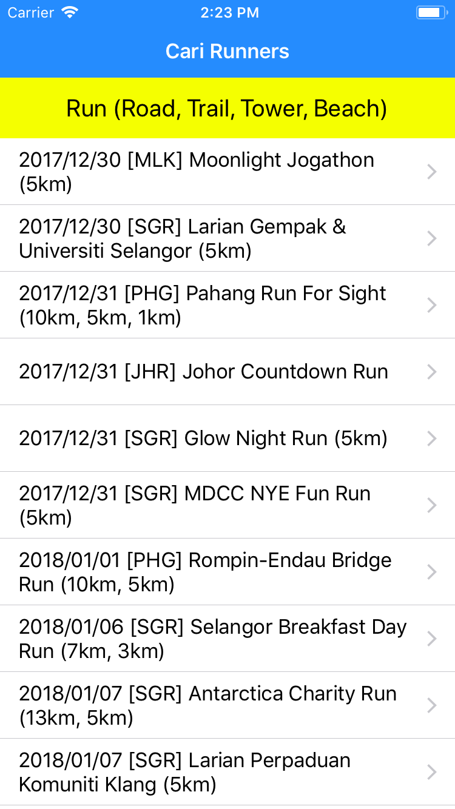

# Run

A Cari Runners blog reader iOS app written in Swift.

## Features

* View latest posts from Cari Runners blog.
* Uses the official [Blogger API v3](https://developers.google.com/blogger/) to read posts.

## Getting Started

1. `git clone https://github.com/fabiolee/ios-run.git`
2. `cd ios-run`
3. `pod install` (requires [CocoaPods](https://cocoapods.org))
4. Open `Run.xcworkspace` in Xcode 9.0 or higher.

## Screenshots

## License

[MIT](LICENSE)
